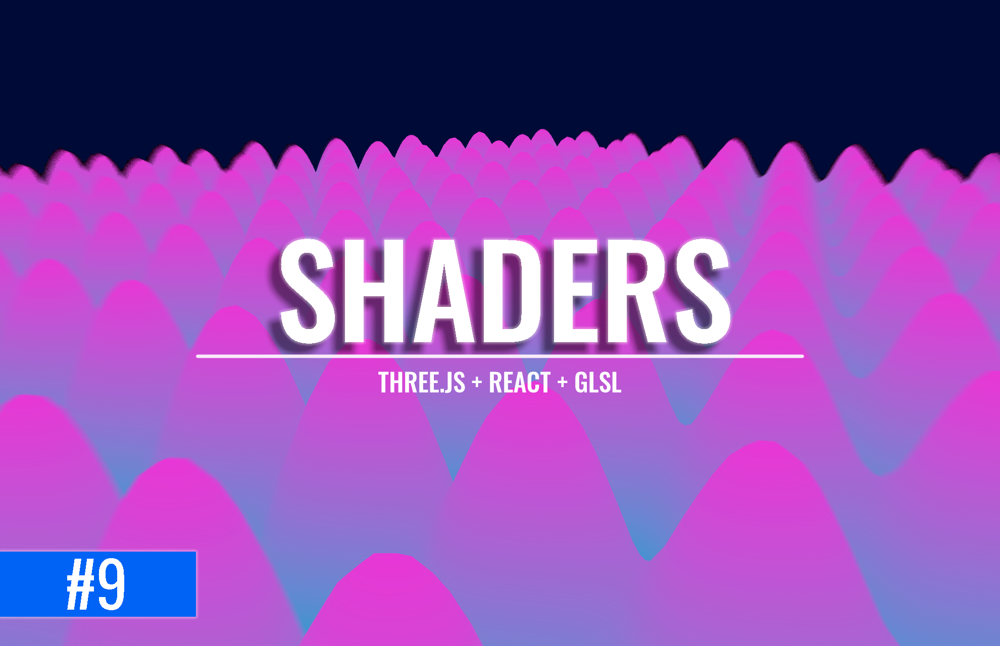

# Shaders
El siguiente repositorio contiene ejemplos de como se puede trabajar usando Shaders(GLSL), con Three.js y React

## Tecnologias
- GLSL
- Three.js
- React

## Enlaces importantes
- Tutorial: 
- Canal de Youtube: https://www.youtube.com/c/JohnScript72
- Shaders Book: https://thebookofshaders.com/glossary/
